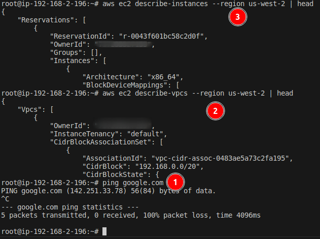
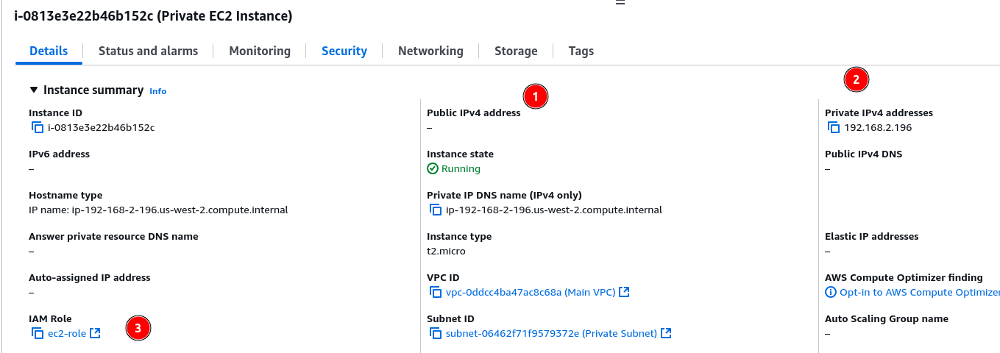
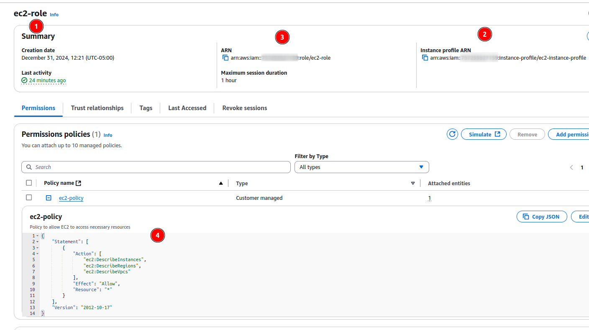
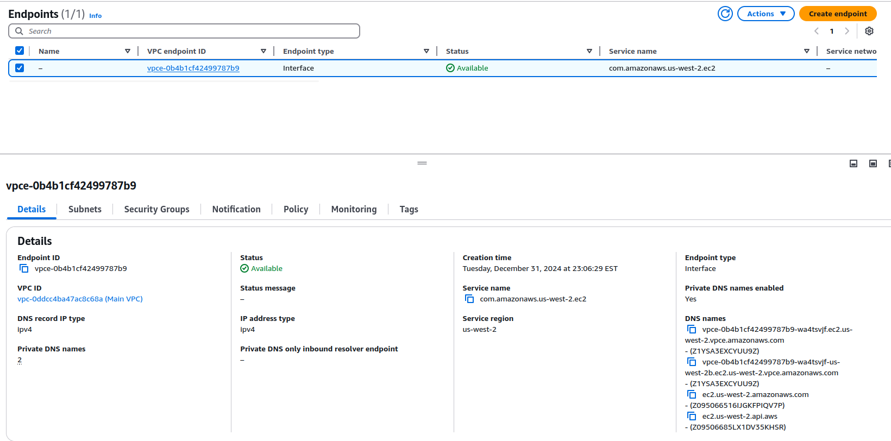

## Private instance in a Private subnet (with no `Internet Gateway` or `NAT Gateway`), able to access AWS ec2 service (based on IAM policy) `privately` via `Interface Endpoint` without going over the public internet.

   
## Interface Endpoint

- This endpoint is used to direct traffic from your VPC to the EC2 service without requiring public internet access. It allows private, secure communication between resources in your VPC and the AWS EC2 API.
- A VPC Interface Endpoint needs to have network interfaces (ENIs) in every subnet where you want resources to access it directly.
- Resources in a given subnet can only route traffic to an endpoint if there is an ENI for the endpoint in that subnet.