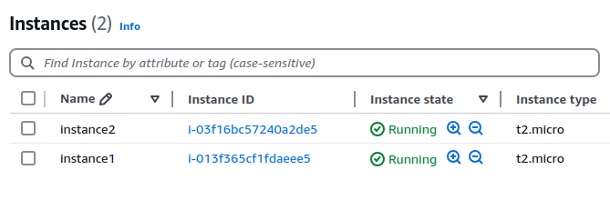

- To include the resource instance name (the `key` from `for_each`), you can use the `tags` attribute.
- When you use the `for_each` argument with resources, the resources are indexed by `keys` from the `for_each` map, and they appear as a map of objects.
