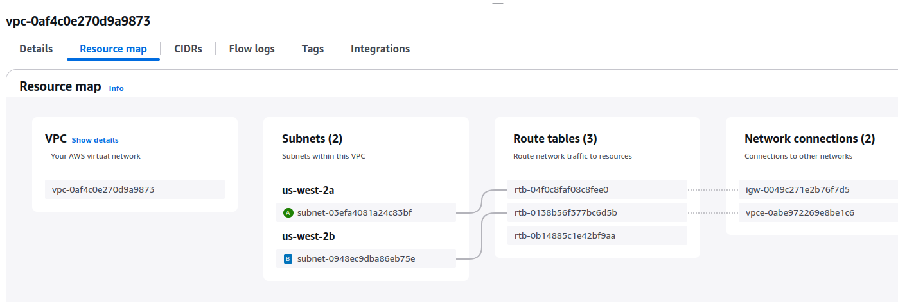
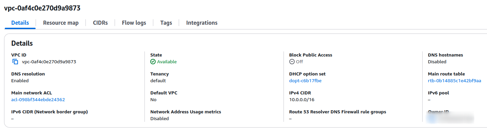
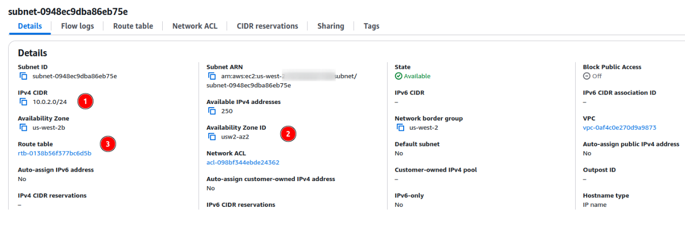
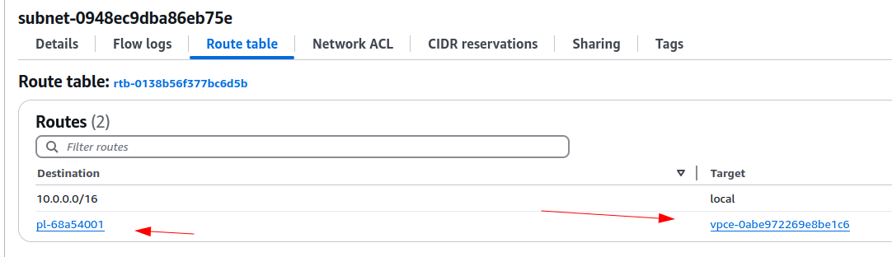
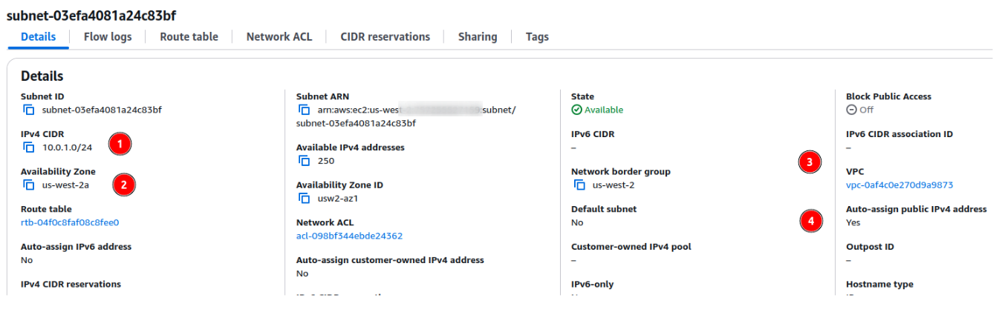
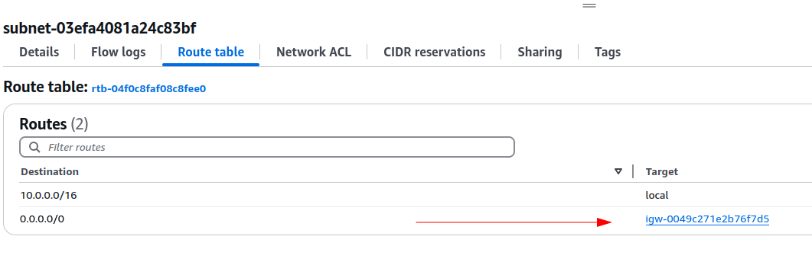
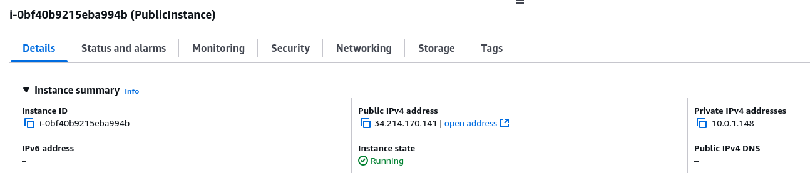
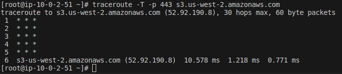
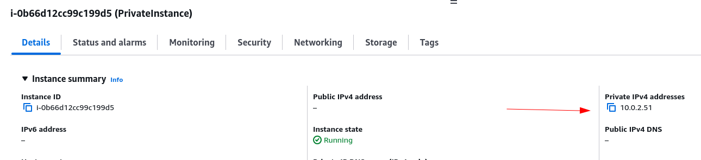

## About VPC

   

## About Private Subnet and associated route table

   

## About Public Subnet and associated route table

   

# Testing
- https://repost.aws/knowledge-center/vpc-check-traffic-flow 

## Using the Public Instance

## Using the Private Instance

