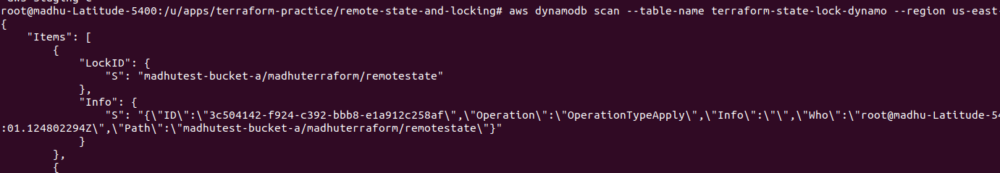

In the context of DynamoDB, the **"LockID": { "S": "madhutest-bucket-a/madhuterraform/remotestate" }** entry is stored as a row in the table. DynamoDB organizes data in items (which are equivalent to rows in a traditional database) and each item has one or more attributes (which are the columns in a relational database).

# Key Points:
- LockID is an attribute in the item (row), and its value is "madhutest-bucket-a/madhuterraform/remotestate", stored as a string (denoted by S).
- Each item represents a row, and each item can have multiple attributes (which can be thought of as columns, but DynamoDB is schema-less except for the primary key).
- If another process tries to create the same LockID, DynamoDB will prevent this because LockID must be unique for each item (row). If the LockID already exists (with same value), the second process will fail to acquire the lock.

# What Happens if Another Process Tries to Create the Same LockID:
- DynamoDB's primary key enforcement: The **LockID** is part of the primary key for the table (in your case, it's likely the partition key). If another process tries to insert the same LockID (with same value), it will either fail with a conditional check failure (if you're using PutItem with a condition) or simply fail if trying to overwrite a pre-existing lock.

